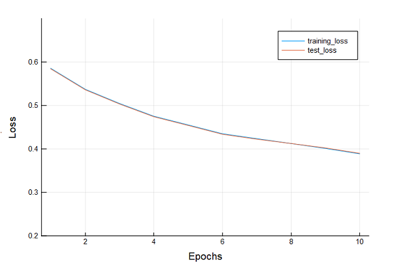

Multi-Layer Perceptron
================

Multi-layer perceptron (MLP) with JULIA
---------------------------------------

A multi-layer perceptron, i.e. a fully connected feed-forward deep neural network, is basically a bunch of linear regression models stuck together with non-linearities in between connecting multiple layers in a directed graph, which means that the signal passes through the nodes in one direction. Each layer requires its own set of parameters and feeds in to the layer above it, until we generate an output. We calculate the value of each layer by first applying a linear function to the acivatiosn of the layer below, and then applying an element-wise nonlinear activation function. Finally, with the final hidden layer, we'll generate an output ...


Here we're going to use **Julia** programming languge and its **Knet** package to fit an **MLP** model to predict Forest Cover Type.

###### The data can be downloaded from <https://archive.ics.uci.edu/ml/machine-learning-databases/covtype/>

``` julia
# we first import the libraries to be used
using Knet, Plots, DataFrames, GZip

# then we read the gzip file and inspecting its size
gz = GZip.open("covtype.data.gz");
data = readtable(gz, separator = ',', header = false); 
size(data)
# (581012, 55)
```

The data has 581012 rows and 55 columns, let's check how many classes in the predicted column .

``` julia
unique(data[end]) , length(unique(data[end]))
# ([5, 2, 1, 7, 3, 6, 4], 7)
```

Seven class from 1 to 7 . So we have over haf a million inputs and 7 outputs.

After inspecting the data with **describe(data)** we see that the first 10 columns need to be scaled.

``` julia
# encode the data with scaling first 10 columns 
x = DataFrame();
for i in 1:size(data, 2)-1
    x[i] = map(Float32, data[i])
    if i <= 10
        x[i] = map(Float32, (data[:, i]- minimum(data[:, i])) / (maximum(data[:, i]) - minimum(data[:, i])))
    end 
end
x[:y] = map(UInt8, data[end]); # changing the class of the output
```

We then split the data randomly to train and test sets every one of them has to have its x features and y outcome. Then we build minibatches of the sets using **minibatch** function to rearrange the data into chunks of 100 instances each ...

``` julia
# split data randomly into train and test
splits = round(Int, 0.1 * size(x, 1));
shuffled = randperm(size(x, 1));
xtrain, ytrain = [Array(x[shuffled[splits + 1:end], 1:end-1])', Array(x[shuffled[splits + 1:end], end])];
xtest, ytest = [Array(x[shuffled[1:splits], 1:end-1])', Array(x[shuffled[1:splits], end])];

btest = minibatch(xtest, ytest, 100); # [(x1,y1), (x2,y2),...] where xi,yi are minibatches of 100
btrain = minibatch(xtrain, ytrain, 100); # xtype = KnetArray{Float32} to use gpu
length(btrain), length(btest)
# (5229, 581)
```

We then define the predict, loss, and train functions to be used by the model ...

``` julia
function predict(w, x)
    for i in 1:2:length(w)
        x = w[i] * x .+ w[i+1]
        if i < length(w)-1
            x = max.(0, x)                         
        end
    end
    return x
end;

loss(w, x, yreal) = nll(predict(w, x), yreal)
lossgradient = grad(loss)

function train(model, data, o)
    for (x, y) in data
        grads = lossgradient(model, x, y)
        update!(model, grads, o)
    end
end;
```

Now as the model is defined, we need to train it. First we randomly initialize the weights and the optimizer ... The model is of 3 hidden layers of 96, 64 and 32 units respectively.

``` julia
# initial weights 
# (3 layers, 54 inputs => 96 units => 64 units => 32 units => 7 outputs)
w = map(Array{Float32},
        Any[ 0.1f0*randn(96, size(xtrain, 1)), zeros(Float32, 96, 1),
               0.1f0*randn(64, 96), zeros(Float32, 64, 1),
               0.1f0*randn(32, 64), zeros(Float32, 32, 1),
           0.1f0*randn(7, 32),  zeros(Float32, 7, 1) ]);

# model optimizer
o = optimizers(w, Adam); # o =  optimizers(w, Sgd;  lr=0.01);
```

``` julia
# initialize loss and error lists to be used for plotting
trnloss = [];
tstloss = [];
trnerror = [];
tsterror = [];
```

Finally we run the model printing the results.

###### This can take a few minutes because it does so many work in each step it calculates accuracy, loss and error for both train and test and they're more than a half a million record ...

``` julia
println((:epoch, 0, :train_accuracy, accuracy(w, btrain, predict), :test_accuracy, accuracy(w, btest, predict)))
# (:epoch, 0, :train_accuracy, 0.04286861732644865, :test_accuracy, 0.04225473321858864)

for epoch in 1:10
    train(w, btrain, o)
    append!(trnloss, nll(w, btrain, predict))
    append!(tstloss, nll(w, btest, predict))
    append!(trnerror, 1-accuracy(w, btrain, predict))
    append!(tsterror, 1-accuracy(w, btest, predict))
    println((:epoch, epoch, :train_accuracy, accuracy(w, btrain, predict), :test_accuracy, accuracy(w, btest, predict)))
end
# (:epoch, 1, :train_accuracy, 0.7492350353796137, :test_accuracy, 0.7504302925989673)
# ...
# (:epoch, 5, :train_accuracy, 0.8048154522853318, :test_accuracy, 0.8048020654044751)
# ...
# (:epoch, 10, :train_accuracy, 0.835922738573341, :test_accuracy, 0.8350602409638554)
```

We can still further improve the model but we now have nice results ... Let's check the loss and error in the train and test datasets .

``` julia
# plot train loss and test loss
plot([trnloss tstloss], ylim=(0.2, 0.7),
    labels = [:training_loss :test_loss], xlabel = "Epochs", ylabel = "Loss")
```



``` julia
# plot train error and test error   
plot([trnerror tsterror], ylim = (0.0, 0.4),
    labels = [:training_error :test_error], xlabel = "Epochs", ylabel = "Error")
```


The model is pretty fine. We how have an idea how we can build **Deep Artificial Neural Networks** using **Julia** ...

###### Furthermore, we can get predicted values to plot or whatever by;

``` julia
yhat = predict(w, xtrain); 
maxval, maxind = findmax(yhat, 1);
yhat = map(x -> ind2sub(yhat, x)[1], maxind);
correct = (map(Float32, yhat[1, :]) .== ytrain);
mean(correct)
# 0.8359242777451612
yhat
# 2  2  2  2  2  1  2  2  4  6  2  2 ...
```
